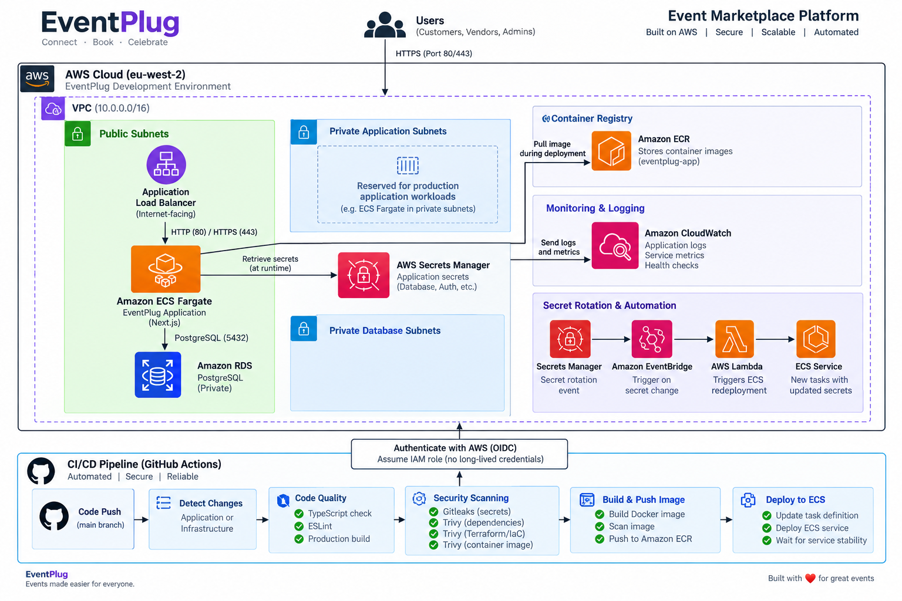

# EventPlug

EventPlug is a cloud-native event marketplace designed to connect customers with event vendors and service providers.

The platform provides an end-to-end workflow for vendor discovery, quotation requests, bookings, messaging, payments, reviews, disputes, notifications, and administrative moderation.

EventPlug is deployed on AWS using containerised workloads, Infrastructure as Code, and an automated security-gated CI/CD pipeline.

---

## Architecture



EventPlug uses a modular AWS architecture designed to separate application, networking, database, security, and deployment concerns.

The current development environment uses Amazon ECS Fargate to run the containerised application behind an internet-facing Application Load Balancer, with PostgreSQL hosted on Amazon RDS.

---

## Key Features

### Customers

- Register and authenticate
- Discover approved event vendors
- Browse vendor services and rental inventory
- Request quotations
- Message vendors
- Accept or decline quotations
- Manage bookings
- Pay deposits and outstanding balances
- Track payment history
- Cancel eligible bookings
- Raise disputes
- Receive platform notifications
- Review vendors after completed bookings

### Vendors

- Register and manage a vendor business
- Maintain business profiles
- Manage services and rental inventory
- Receive quotation requests
- Review customer requirements
- Submit quotations
- Manage bookings
- Message customers
- Track payments
- Manage booking lifecycle
- Receive customer reviews
- Receive real-time platform notifications

### Administrators

- Review and approve vendors
- Suspend or manage vendor accounts
- Manage vendor categories
- Monitor bookings
- Manage disputes
- Moderate reviews
- Manage featured vendors
- Monitor platform activity

---

## Technology Stack

### Application

- Next.js
- React
- TypeScript
- Prisma ORM
- PostgreSQL
- NextAuth
- Docker

### AWS

- Amazon VPC
- Amazon ECS Fargate
- Amazon ECR
- Application Load Balancer
- Amazon RDS for PostgreSQL
- AWS Secrets Manager
- AWS IAM
- Amazon CloudWatch
- AWS Lambda
- Amazon EventBridge
- Amazon S3

### Infrastructure as Code

- Terraform
- Modular Terraform architecture
- Remote Terraform state
- Environment-specific configuration

### CI/CD & DevSecOps

- GitHub Actions
- GitHub OIDC authentication to AWS
- Gitleaks
- Trivy
- TypeScript validation
- ESLint
- Docker image security scanning
- Terraform security scanning
- Automated deployment gates

---

## AWS Architecture

The application currently follows this request flow:

```text
Internet
   │
   ▼
Application Load Balancer
   │
   ▼
ECS Fargate
   │
   ├──────────────► AWS Secrets Manager
   │
   ├──────────────► Amazon CloudWatch
   │
   ▼
Amazon RDS PostgreSQL
```

The VPC contains multiple network tiers:

```text
VPC
│
├── Public Subnets
│   ├── Application Load Balancer
│   └── ECS Fargate (development environment)
│
├── Private Application Subnets
│   └── Reserved for private application workloads
│
└── Private Database Subnets
    └── Amazon RDS PostgreSQL
```

The database is not publicly exposed.

Security groups restrict communication between infrastructure components, including ALB-to-ECS and ECS-to-RDS traffic.

---

## CI/CD Pipeline

Changes pushed to the `main` branch are processed by GitHub Actions.

The pipeline uses change detection so application and infrastructure changes can follow the appropriate validation path.

```text
                         Git Push
                            │
                            ▼
                     Detect Changes
                       /         \
                      /           \
                     ▼             ▼
              Code Quality    Security Scan
                     │             │
              TypeScript         Gitleaks
                 ESLint           Trivy
             Production Build    IaC Scan
                      \           /
                       \         /
                        ▼       ▼
                       Security Gate
                            │
                            ▼
                       Docker Build
                            │
                            ▼
                    Trivy Image Scan
                            │
                            ▼
                       Amazon ECR
                            │
                            ▼
                       ECS Fargate
                            │
                            ▼
                    Service Stability
```

Application deployment proceeds only after the required quality and security checks succeed.

Infrastructure-only changes can be security-scanned without unnecessarily rebuilding and deploying the application.

---

## DevSecOps

Security checks are integrated directly into the deployment workflow rather than being treated as a separate manual process.

### Code Quality

Before deployment, the pipeline performs:

- TypeScript type checking
- ESLint validation
- Production application build

### Secret Scanning

Gitleaks scans the repository for accidentally committed credentials and secrets.

### Dependency Scanning

Trivy scans application dependencies for known vulnerabilities.

### Infrastructure Security

Terraform configuration is scanned with Trivy for AWS security misconfigurations.

### Container Security

The final Docker image is scanned before it is pushed to Amazon ECR.

The pipeline is configured to block deployment when configured critical security findings are detected.

---

## Container Security

EventPlug uses a multi-stage Docker build to separate dependency installation, application compilation, and runtime execution.

The final container runs as a non-root user.

```text
Dependencies Stage
       │
       ▼
Build Stage
       │
       ▼
Minimal Runtime Stage
       │
       ▼
ECS Fargate
```

Unnecessary package-management tooling is removed from the production runtime image to reduce the attack surface.

During implementation, the container security gate detected a critical vulnerability in tooling inherited from the Node base image.

Rather than suppressing the finding, the unnecessary tooling was removed from the runtime image and the image was rescanned successfully.

This keeps security findings actionable while maintaining the deployment gate.

---

## Infrastructure as Code

AWS infrastructure is managed using Terraform.

The infrastructure is organised into reusable modules:

```text
infrastructure/
├── bootstrap/
├── environments/
│   └── dev/
└── modules/
    ├── networking/
    ├── security/
    ├── database/
    ├── ecr/
    ├── ecs/
    ├── app-secrets/
    ├── github-actions/
    └── secret-rotation-redeploy/
```

This separation allows infrastructure components to be managed independently while remaining part of the same platform architecture.

---

## Networking

The EventPlug VPC is designed with separate network tiers.

### Public Subnets

Used for internet-facing resources such as the Application Load Balancer.

The current development ECS deployment also operates from the public tier while the platform is being developed.

### Private Application Subnets

Provisioned for application workloads that do not require direct public exposure.

Moving ECS workloads into these subnets is part of the production architecture roadmap.

### Private Database Subnets

Amazon RDS runs inside private database subnets and is not directly accessible from the internet.

---

## Security Groups

Network communication follows service-to-service rules rather than exposing backend services unnecessarily.

```text
Internet
   │
   │ HTTP/HTTPS
   ▼
ALB Security Group
   │
   │ Application Port
   ▼
ECS Security Group
   │
   │ PostgreSQL 5432
   ▼
RDS Security Group
```

The Application Load Balancer is permitted to communicate with ECS on the application port.

RDS accepts PostgreSQL traffic from the ECS security group rather than from the public internet.

---

## Secrets Management

Sensitive application values are stored in AWS Secrets Manager rather than being committed to source control.

The ECS task definition retrieves required secrets at runtime using IAM permissions.

Examples include:

- Database credentials
- Authentication secrets
- Application secrets

Database credentials are injected into the ECS task and used by the application to construct the database connection securely at runtime.

---

## Secret Rotation

EventPlug includes infrastructure for responding to secret rotation events.

AWS EventBridge and Lambda are used to trigger ECS redeployment when relevant secrets change, allowing new tasks to retrieve updated secret values.

```text
Secrets Manager
      │
      ▼
Secret Rotation Event
      │
      ▼
EventBridge
      │
      ▼
Lambda
      │
      ▼
ECS Service Redeployment
      │
      ▼
New Task Retrieves Secret
```

---

## AWS Authentication for CI/CD

GitHub Actions authenticates to AWS using OpenID Connect (OIDC).

```text
GitHub Actions
      │
      │ OIDC Token
      ▼
AWS IAM Role
      │
      ▼
Temporary AWS Credentials
```

This avoids storing long-lived AWS access keys in GitHub.

The pipeline assumes an IAM role with the permissions required to perform the deployment.

---

## Container Registry

Docker images are stored in Amazon Elastic Container Registry (ECR).

Each deployment uses the Git commit SHA as the container image tag.

```text
Application Source
       │
       ▼
Docker Build
       │
       ▼
Trivy Security Scan
       │
       ▼
Amazon ECR
       │
       ▼
ECS Task Definition
       │
       ▼
ECS Service
```

This provides traceability between deployed infrastructure and source-code revisions.

---

## Booking Lifecycle

EventPlug supports the complete lifecycle from vendor discovery to post-event review.

```text
Customer Discovers Vendor
          │
          ▼
    Requests Quote
          │
          ▼
 Vendor Reviews Request
          │
          ▼
  Vendor Sends Quote
          │
          ▼
 Customer Accepts Quote
          │
          ▼
     Booking Created
          │
          ▼
      Pay Deposit
          │
          ▼
    Booking Confirmed
          │
          ▼
      Pay Balance
          │
          ▼
    Event In Progress
          │
          ▼
   Booking Completed
          │
          ▼
    Customer Review
```

Bookings also support cancellation and dispute workflows depending on their current lifecycle state.

---

## Payments

The development environment currently uses a mock payment provider.

The payment architecture supports:

- Deposit payments
- Full payments
- Outstanding balance payments
- Payment history
- Payment status tracking
- Booking status transitions
- Customer payment notifications
- Vendor payment notifications
- Duplicate submission protection
- Prevention of overpayment

The payment workflow separates database transactions from external provider calls so long-running network operations do not hold database transactions open.

Production integration will require a real payment provider such as Paystack or Hubtel together with webhook verification and provider-level idempotency.

---

## Messaging

Customers and vendors can communicate through conversations associated with the platform.

Messaging supports:

- Starting conversations
- Customer-to-vendor messages
- Vendor-to-customer replies
- Unread message tracking
- Message notifications
- Conversation navigation from notifications

---

## Notifications

EventPlug provides platform notifications for important lifecycle events.

Examples include:

- New quote requests
- New messages
- Quotations received
- Quotations accepted or declined
- Successful payments
- Booking cancellations
- Booking status changes
- Disputes
- Dispute resolutions
- Completed bookings
- Customer reviews

The notification bell displays unread activity and links users directly to the relevant area of the application.

---

## Disputes

Customers can raise disputes against eligible bookings.

The dispute workflow supports:

```text
Customer Raises Dispute
        │
        ▼
Booking → DISPUTED
        │
        ▼
Vendor Notified
        │
        ▼
Admin Reviews Dispute
        │
        ▼
Admin Resolution
        │
        ▼
Customer Notified
```

---

## Reviews

Customers can review vendors after eligible completed bookings.

Reviews include:

- Star rating
- Written feedback
- Booking validation
- Duplicate-review prevention
- Vendor rating recalculation
- Vendor notifications
- Administrative moderation

---

## Observability

Application logs are sent to Amazon CloudWatch.

ECS service health is also validated during deployment before the pipeline is considered successful.

Further observability improvements are planned for production, including dashboards, alarms, and application-level metrics.

---

## Current Environment

The development environment is deployed in:

```text
AWS Region: eu-west-2 (London)
Environment: dev
Compute: Amazon ECS Fargate
Database: Amazon RDS PostgreSQL
Container Registry: Amazon ECR
Infrastructure: Terraform
CI/CD: GitHub Actions
```

---

## Production Roadmap

The current environment is intentionally optimised for development and controlled testing.

Planned production improvements include:

- Custom EventPlug domain
- Amazon Route 53 DNS
- AWS Certificate Manager TLS certificate
- HTTPS listener on the Application Load Balancer
- HTTP-to-HTTPS redirection
- ECS workloads moved to private application subnets
- Controlled private-subnet outbound connectivity
- AWS WAF
- Real payment-provider integration
- Payment webhook verification
- Provider-level payment idempotency
- Refund workflows
- Enhanced CloudWatch dashboards and alarms
- Backup and disaster-recovery policies
- Production environment separation
- Additional availability and scaling controls

---

## Repository Structure

```text
EventPlug/
├── .github/
│   └── workflows/
│       └── deploy-dev.yml
│
├── docs/
│   └── architecture/
│       └── eventplug-aws-architecture.png
│
├── eventplug-app/
│   ├── prisma/
│   ├── public/
│   ├── scripts/
│   ├── src/
│   ├── Dockerfile
│   └── package.json
│
├── infrastructure/
│   ├── bootstrap/
│   ├── environments/
│   └── modules/
│
└── README.md
```

---

## Engineering Principles

EventPlug was built around several core engineering principles:

- Infrastructure should be reproducible
- Deployments should be automated
- Security should be part of CI/CD
- Secrets should not live in source control
- Cloud access should use short-lived credentials
- Backend services should not be unnecessarily exposed
- Containers should run with the minimum required tooling
- Failed security gates should prevent deployment
- Infrastructure and application changes should be auditable
- Development architecture should have a clear path toward production

---

## Status

**Development environment: Operational**

The core EventPlug marketplace, AWS infrastructure, Terraform modules, container deployment, CI/CD pipeline, security scanning, messaging, booking lifecycle, payments, disputes, reviews, and notifications have been implemented.

The next phase focuses on production hardening, HTTPS/custom-domain configuration, real payment-provider integration, and enhanced observability.