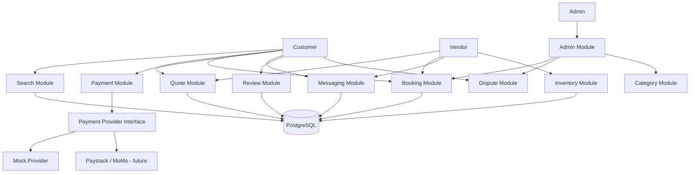
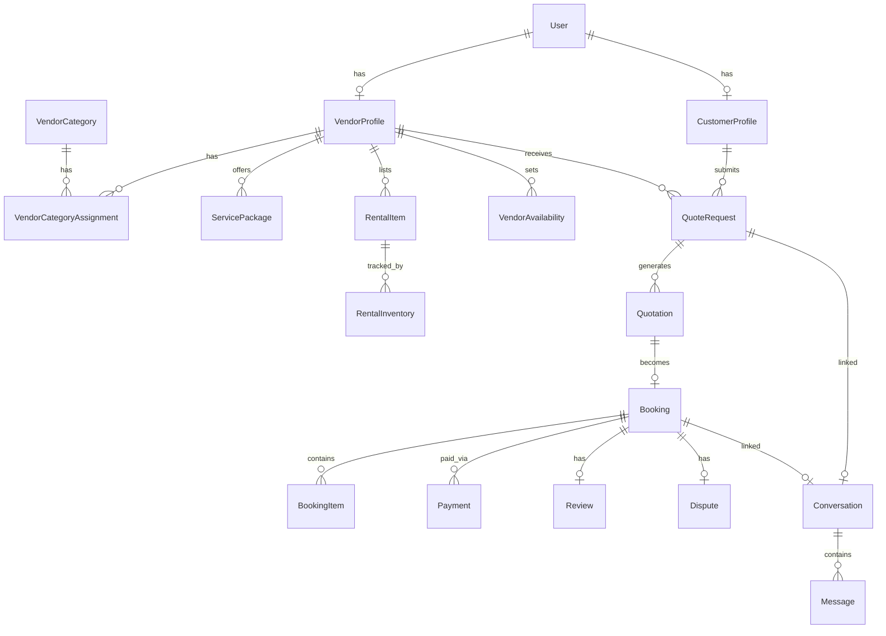
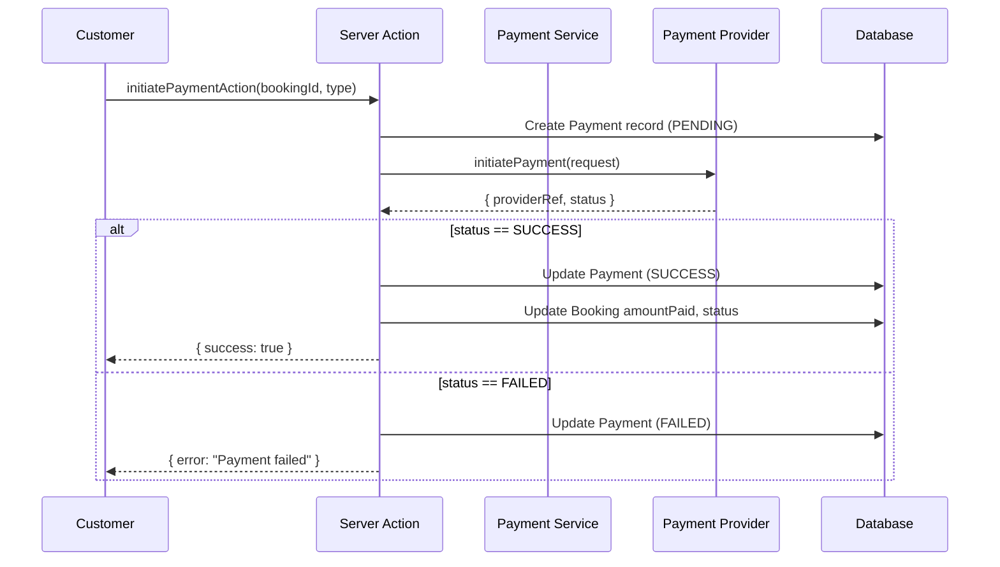
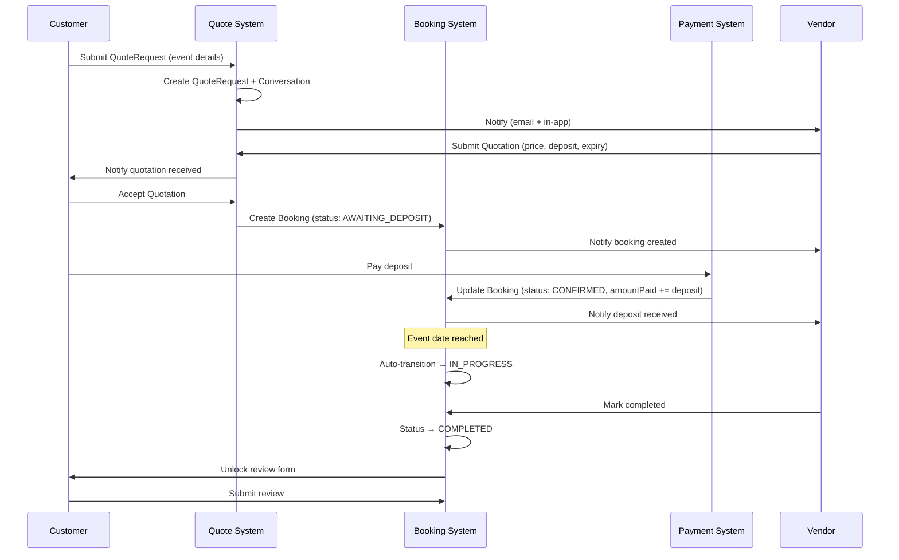
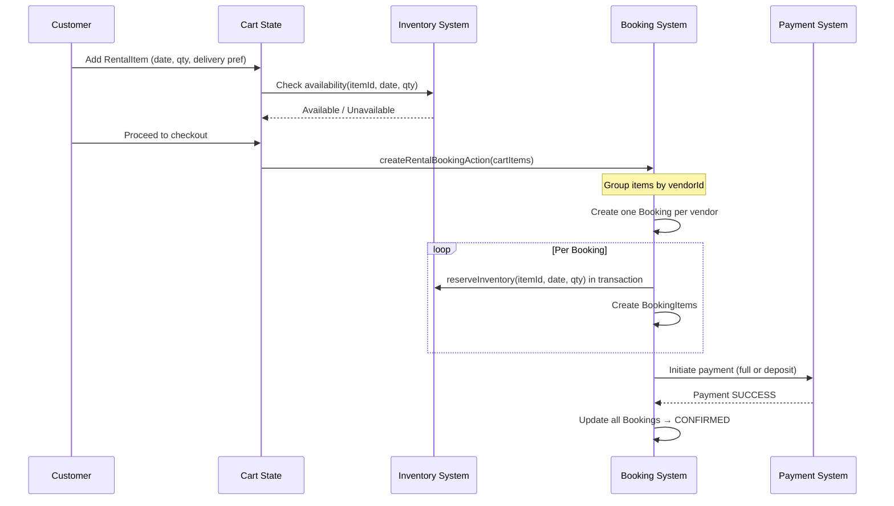
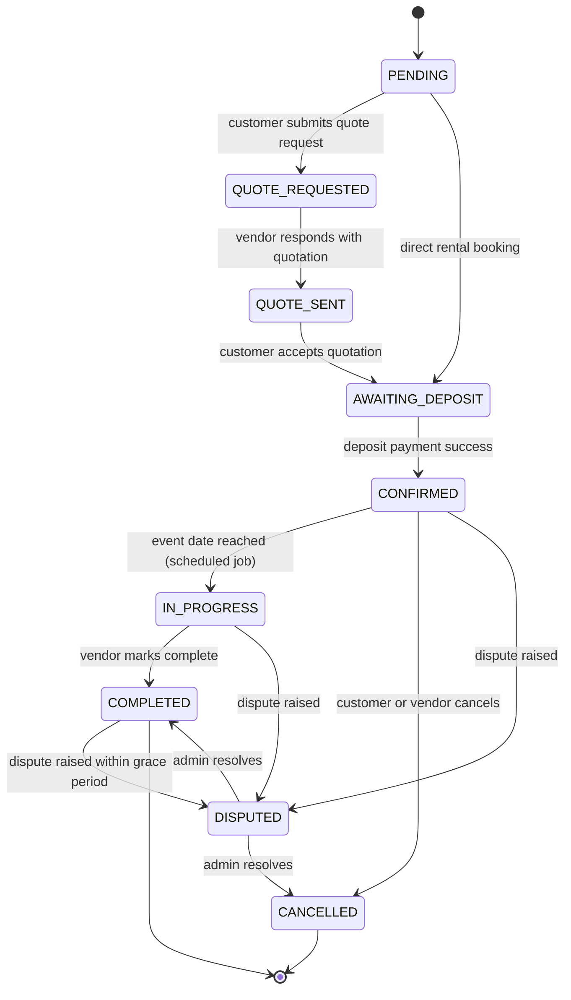

# Design Document: Ghana Events Marketplace

## Overview

Ghana Events Marketplace is a two-sided marketplace web application that connects event-service customers with vendors across Ghana. It replaces fragmented discovery on social media and WhatsApp with a single, trustworthy platform covering service vendors (photographers, caterers, decorators, event planners, DJs) and rental vendors (chairs, tables, canopies, sound systems).

### Key Design Goals

- **Modular monolith**: All features live in one Next.js application, organized into clearly bounded modules (Auth, Search, Quote, Booking, Inventory, Payment, Messaging, Review, Dispute, Admin). No microservices.
- **Server-first rendering**: Next.js App Router server components fetch data directly; client components are used only where interactivity requires it.
- **Pluggable payments**: A payment abstraction layer allows swapping Mobile Money / Paystack / Hubtel without touching booking or payment data models.
- **Overbooking prevention**: Inventory reservation is date-aware and enforced at the database level with row-level checks.
- **Role-based access**: Three roles — Customer, Vendor, Admin — enforced at middleware and server-action levels.
- **Mobile-first UI**: Tailwind CSS + shadcn/ui with responsive breakpoints at 320px, 768px, and 1280px+.

### Technology Stack

| Layer | Choice |
|---|---|
| Framework | Next.js 14 (App Router) |
| Language | TypeScript |
| UI | React, Tailwind CSS, shadcn/ui |
| Database | PostgreSQL |
| ORM | Prisma |
| Auth | NextAuth.js v5 (session-based, JWT) |
| Validation | Zod |
| File Upload | Uploadthing (S3-compatible) |
| Email | Resend (transactional) |
| Testing | Vitest + fast-check (property tests) |

---

## Architecture

### Application Structure (Next.js App Router)

```
src/
├── app/                          # Next.js App Router pages
│   ├── (marketing)/              # Public marketing pages (homepage, about, etc.)
│   │   ├── page.tsx              # Homepage
│   │   ├── about/
│   │   └── how-it-works/
│   ├── (marketplace)/            # Public marketplace pages
│   │   ├── vendors/
│   │   │   ├── page.tsx          # Vendor listing page
│   │   │   └── [slug]/page.tsx   # Vendor profile page
│   │   └── rentals/
│   │       ├── page.tsx          # Rental listing page
│   │       └── [id]/page.tsx     # Rental item detail page
│   ├── (auth)/                   # Auth pages (login, register)
│   │   ├── login/page.tsx
│   │   ├── register/customer/page.tsx
│   │   └── register/vendor/page.tsx
│   ├── dashboard/
│   │   ├── customer/             # Customer dashboard (protected)
│   │   │   ├── layout.tsx
│   │   │   ├── page.tsx          # Overview
│   │   │   ├── bookings/
│   │   │   ├── quotes/
│   │   │   ├── messages/
│   │   │   ├── favourites/
│   │   │   ├── payments/
│   │   │   ├── reviews/
│   │   │   └── profile/
│   │   ├── vendor/               # Vendor dashboard (protected)
│   │   │   ├── layout.tsx
│   │   │   ├── page.tsx          # Overview
│   │   │   ├── bookings/
│   │   │   ├── quotes/
│   │   │   ├── calendar/
│   │   │   ├── services/
│   │   │   ├── inventory/
│   │   │   ├── messages/
│   │   │   ├── payments/
│   │   │   ├── reviews/
│   │   │   ├── analytics/
│   │   │   └── profile/
│   │   └── admin/                # Admin dashboard (protected)
│   │       ├── layout.tsx
│   │       ├── page.tsx          # Overview
│   │       ├── vendors/
│   │       ├── bookings/
│   │       ├── categories/
│   │       ├── reviews/
│   │       ├── disputes/
│   │       ├── featured/
│   │       └── reports/
│   └── api/                      # API routes
│       ├── auth/[...nextauth]/
│       ├── vendors/
│       ├── rentals/
│       ├── bookings/
│       ├── quotes/
│       ├── payments/
│       ├── messages/
│       └── uploads/
├── lib/
│   ├── auth/                     # Auth configuration and helpers
│   ├── db/                       # Prisma client and query helpers
│   ├── modules/                  # Business logic modules
│   │   ├── search/
│   │   ├── booking/
│   │   ├── inventory/
│   │   ├── payment/
│   │   ├── messaging/
│   │   ├── quote/
│   │   ├── review/
│   │   └── dispute/
│   ├── payment-providers/        # Payment abstraction layer
│   │   ├── types.ts              # IPaymentProvider interface
│   │   ├── mock.ts               # Mock implementation
│   │   ├── paystack.ts           # Paystack (future)
│   │   └── momo.ts               # Mobile Money (future)
│   └── validations/              # Zod schemas
├── components/
│   ├── ui/                       # shadcn/ui base components
│   ├── shared/                   # Cross-cutting shared components
│   ├── marketing/                # Homepage and landing components
│   ├── marketplace/              # Vendor/rental card and list components
│   ├── dashboard/                # Dashboard layout and nav components
│   └── forms/                    # Reusable form components
└── actions/                      # Next.js Server Actions
    ├── auth.ts
    ├── vendor.ts
    ├── booking.ts
    ├── quote.ts
    ├── payment.ts
    ├── message.ts
    ├── review.ts
    └── dispute.ts
```

### Module Interaction Diagram



### Request Flow

All customer-facing pages use Next.js server components for initial data fetch. Interactive mutations go through server actions (form posts) or thin API routes (programmatic access). Middleware enforces auth and role checks before any route handler executes.

```
Browser → middleware (auth + role check) → Server Component (data fetch via Prisma)
                                          → Server Action (mutation via Prisma)
                                          → API Route (programmatic / webhook)
```

---

## Components and Interfaces

### Authentication and Authorization

#### Session Model

NextAuth.js v5 with JWT strategy. The JWT encodes `userId`, `role` (`CUSTOMER` | `VENDOR` | `ADMIN`), and `vendorProfileId` (for vendors). Sessions expire after 7 days with a 24-hour sliding refresh.

#### Middleware Route Protection

`src/middleware.ts` intercepts every request and:

1. Reads the session token from the cookie.
2. Redirects unauthenticated requests to `/login?callbackUrl=<original>`.
3. Enforces role-based path prefixes:
   - `/dashboard/customer/*` — requires `CUSTOMER` role.
   - `/dashboard/vendor/*` — requires `VENDOR` role.
   - `/dashboard/admin/*` — requires `ADMIN` role.
4. Allows all public routes through without auth.

```typescript
// src/middleware.ts (simplified)
export const config = {
  matcher: ['/dashboard/:path*', '/api/bookings/:path*', '/api/quotes/:path*']
}

export async function middleware(req: NextRequest) {
  const token = await getToken({ req })
  const { pathname } = req.nextUrl

  if (!token) return NextResponse.redirect(new URL(`/login?callbackUrl=${pathname}`, req.url))

  if (pathname.startsWith('/dashboard/customer') && token.role !== 'CUSTOMER')
    return NextResponse.redirect(new URL('/dashboard', req.url))
  if (pathname.startsWith('/dashboard/vendor') && token.role !== 'VENDOR')
    return NextResponse.redirect(new URL('/dashboard', req.url))
  if (pathname.startsWith('/dashboard/admin') && token.role !== 'ADMIN')
    return NextResponse.redirect(new URL('/dashboard', req.url))
}
```

#### Server Action Auth Guard

Every server action calls a shared `requireAuth(role?)` helper that reads the session and throws `UnauthorizedError` if the role does not match.

```typescript
// src/lib/auth/guards.ts
export async function requireAuth(role?: Role): Promise<Session> {
  const session = await auth()
  if (!session) throw new UnauthorizedError('Not authenticated')
  if (role && session.user.role !== role) throw new ForbiddenError('Insufficient role')
  return session
}
```

### API Route Design

All API routes follow REST conventions and return JSON. Routes validate request payloads with Zod before processing.

| Method | Path | Description | Auth |
|---|---|---|---|
| GET | `/api/vendors` | Search/list vendors | Public |
| GET | `/api/vendors/[slug]` | Get vendor profile | Public |
| GET | `/api/rentals` | Search/list rental items | Public |
| GET | `/api/rentals/[id]` | Get rental item detail | Public |
| GET | `/api/rentals/[id]/availability` | Check availability for date | Public |
| POST | `/api/quotes` | Submit quote request | Customer |
| GET | `/api/quotes/[id]` | Get quote request | Customer/Vendor |
| POST | `/api/quotes/[id]/respond` | Vendor submits quotation | Vendor |
| POST | `/api/quotes/[id]/accept` | Customer accepts quotation | Customer |
| POST | `/api/quotes/[id]/decline` | Customer declines quotation | Customer |
| GET | `/api/bookings` | List bookings (scoped by role) | Auth |
| GET | `/api/bookings/[id]` | Get booking detail | Auth |
| POST | `/api/bookings` | Create booking (rental cart) | Customer |
| PATCH | `/api/bookings/[id]/status` | Update booking status | Auth |
| POST | `/api/payments` | Initiate payment | Customer |
| GET | `/api/payments/[id]` | Get payment | Auth |
| POST | `/api/payments/callback` | Payment provider webhook | Service |
| GET | `/api/messages/conversations` | List conversations | Auth |
| GET | `/api/messages/conversations/[id]` | Get messages in conversation | Auth |
| POST | `/api/messages/conversations/[id]` | Send message | Auth |
| POST | `/api/disputes` | Raise dispute | Auth |
| GET | `/api/admin/vendors` | List all vendors | Admin |
| PATCH | `/api/admin/vendors/[id]/status` | Approve/suspend vendor | Admin |
| GET | `/api/admin/categories` | List categories | Admin |
| POST | `/api/admin/categories` | Create category | Admin |
| PATCH | `/api/admin/categories/[id]` | Update category | Admin |
| POST | `/api/uploads/sign` | Get signed upload URL | Auth |

### Server Actions Design

Server actions handle all form-based mutations. Each action is co-located with its feature module in `src/actions/`.

```typescript
// Pattern for all server actions
'use server'
import { requireAuth } from '@/lib/auth/guards'
import { db } from '@/lib/db'
import { SomeInputSchema } from '@/lib/validations/some-feature'
import { revalidatePath } from 'next/cache'

export async function doSomethingAction(formData: FormData) {
  const session = await requireAuth('CUSTOMER')
  const parsed = SomeInputSchema.safeParse(Object.fromEntries(formData))
  if (!parsed.success) return { error: parsed.error.flatten() }

  // business logic via db
  await db.someModel.create({ data: { ...parsed.data, userId: session.user.id } })
  revalidatePath('/dashboard/customer/bookings')
  return { success: true }
}
```

Key server actions by module:

| Action | Module | Auth |
|---|---|---|
| `registerCustomerAction` | Auth | Public |
| `registerVendorAction` | Auth | Public |
| `updateVendorProfileAction` | Vendor | Vendor |
| `createServicePackageAction` | Vendor | Vendor |
| `createRentalItemAction` | Inventory | Vendor |
| `updateRentalInventoryAction` | Inventory | Vendor |
| `setAvailabilityAction` | Availability | Vendor |
| `submitQuoteRequestAction` | Quote | Customer |
| `submitQuotationAction` | Quote | Vendor |
| `acceptQuotationAction` | Quote | Customer |
| `declineQuotationAction` | Quote | Customer |
| `createRentalBookingAction` | Booking | Customer |
| `updateBookingStatusAction` | Booking | Vendor/Admin |
| `cancelBookingAction` | Booking | Customer |
| `initiatePaymentAction` | Payment | Customer |
| `sendMessageAction` | Messaging | Auth |
| `submitReviewAction` | Review | Customer |
| `raiseDisputeAction` | Dispute | Auth |
| `approveVendorAction` | Admin | Admin |
| `suspendVendorAction` | Admin | Admin |
| `manageCategoryAction` | Admin | Admin |
| `saveFavouriteAction` | Customer | Customer |

---

## Data Models

All models are defined in a single `schema.prisma` file and managed via Prisma migrations.

### Enums

```prisma
enum Role {
  CUSTOMER
  VENDOR
  ADMIN
}

enum VendorStatus {
  PENDING
  APPROVED
  SUSPENDED
}

enum VendorType {
  SERVICE
  RENTAL
  BOTH
}

enum BookingStatus {
  PENDING
  QUOTE_REQUESTED
  QUOTE_SENT
  AWAITING_DEPOSIT
  CONFIRMED
  IN_PROGRESS
  COMPLETED
  CANCELLED
  DISPUTED
}

enum QuoteStatus {
  PENDING
  SENT
  ACCEPTED
  DECLINED
  EXPIRED
}

enum PaymentType {
  FULL
  DEPOSIT
  BALANCE
}

enum PaymentStatus {
  PENDING
  SUCCESS
  FAILED
  REFUNDED
}

enum PaymentMethod {
  MOCK
  MOBILE_MONEY
  PAYSTACK
  HUBTEL
}

enum PricingPeriod {
  PER_DAY
  PER_EVENT
}

enum DisputeType {
  VENDOR_NO_SHOW
  ITEM_NOT_DELIVERED
  QUALITY_ISSUE
  PAYMENT_ISSUE
  OTHER
}

enum DisputeStatus {
  OPEN
  UNDER_REVIEW
  RESOLVED
  CLOSED
}

enum DisputeOutcome {
  CUSTOMER_FAVOUR
  VENDOR_FAVOUR
  MUTUAL_RESOLUTION
}

enum MessageReadStatus {
  UNREAD
  READ
}

enum AvailabilityState {
  AVAILABLE
  LIMITED
  UNAVAILABLE
}
```

### Core Models

```prisma
model User {
  id              String          @id @default(cuid())
  email           String          @unique
  passwordHash    String
  role            Role
  createdAt       DateTime        @default(now())
  updatedAt       DateTime        @updatedAt

  customerProfile CustomerProfile?
  vendorProfile   VendorProfile?
  sentMessages    Message[]       @relation("SentMessages")
  notifications   Notification[]
  sessions        Session[]

  @@index([email])
}

model CustomerProfile {
  id            String    @id @default(cuid())
  userId        String    @unique
  user          User      @relation(fields: [userId], references: [id], onDelete: Cascade)
  fullName      String
  phoneNumber   String
  profilePhoto  String?
  createdAt     DateTime  @default(now())
  updatedAt     DateTime  @updatedAt

  bookings      Booking[]
  quoteRequests QuoteRequest[]
  reviews       Review[]
  favourites    Favourite[]
  conversations ConversationParticipant[]
}

model VendorProfile {
  id                  String        @id @default(cuid())
  userId              String        @unique
  user                User          @relation(fields: [userId], references: [id], onDelete: Cascade)
  businessName        String
  slug                String        @unique
  ownerFullName       String
  phoneNumber         String
  email               String
  description         String?       @db.VarChar(1000)
  logoUrl             String?
  coverImageUrl       String?
  vendorType          VendorType    @default(SERVICE)
  status              VendorStatus  @default(PENDING)
  primaryCategoryId   String
  primaryCategory     VendorCategory @relation("PrimaryCategory", fields: [primaryCategoryId], references: [id])
  serviceLocations    String[]      // Array of region/city strings
  isPhoneVerified     Boolean       @default(false)
  isGhanaCardVerified Boolean       @default(false)
  isBusinessVerified  Boolean       @default(false)
  isAddressVerified   Boolean       @default(false)
  averageRating       Float         @default(0)
  totalReviews        Int           @default(0)
  totalBookings       Int           @default(0)
  isFeatured          Boolean       @default(false)
  createdAt           DateTime      @default(now())
  updatedAt           DateTime      @updatedAt

  categories          VendorCategoryAssignment[]
  portfolioImages     PortfolioImage[]
  servicePackages     ServicePackage[]
  rentalItems         RentalItem[]
  availability        VendorAvailability[]
  bookingsAsVendor    Booking[]
  quoteRequests       QuoteRequest[]
  conversations       ConversationParticipant[]
  reviews             Review[]
  disputes            Dispute[]

  @@index([status])
  @@index([isFeatured])
  @@index([slug])
}

model VendorCategory {
  id            String    @id @default(cuid())
  name          String    @unique
  type          VendorType
  iconReference String?
  displayOrder  Int       @default(0)
  isActive      Boolean   @default(true)
  createdAt     DateTime  @default(now())
  updatedAt     DateTime  @updatedAt

  primaryVendors      VendorProfile[]  @relation("PrimaryCategory")
  vendorAssignments   VendorCategoryAssignment[]
  servicePackages     ServicePackage[]
  rentalItems         RentalItem[]

  @@index([isActive])
  @@index([type])
}

model VendorCategoryAssignment {
  vendorId    String
  categoryId  String
  vendor      VendorProfile  @relation(fields: [vendorId], references: [id], onDelete: Cascade)
  category    VendorCategory @relation(fields: [categoryId], references: [id])

  @@id([vendorId, categoryId])
}

model PortfolioImage {
  id        String  @id @default(cuid())
  vendorId  String
  vendor    VendorProfile @relation(fields: [vendorId], references: [id], onDelete: Cascade)
  url       String
  caption   String?
  order     Int     @default(0)
  createdAt DateTime @default(now())

  @@index([vendorId])
}
```

### Service and Rental Models

```prisma
model ServicePackage {
  id              String    @id @default(cuid())
  vendorId        String
  vendor          VendorProfile @relation(fields: [vendorId], references: [id], onDelete: Cascade)
  categoryId      String
  category        VendorCategory @relation(fields: [categoryId], references: [id])
  name            String
  description     String    @db.Text
  includedServices String[] // List of included service line items
  startingPrice   Decimal   @db.Decimal(12, 2)
  isActive        Boolean   @default(true)
  addOns          Json?     // Array of { name: string, price: Decimal }
  createdAt       DateTime  @default(now())
  updatedAt       DateTime  @updatedAt

  bookingItems    BookingItem[]

  @@index([vendorId, isActive])
}

model RentalItem {
  id               String    @id @default(cuid())
  vendorId         String
  vendor           VendorProfile @relation(fields: [vendorId], references: [id], onDelete: Cascade)
  categoryId       String
  category         VendorCategory @relation(fields: [categoryId], references: [id])
  name             String
  description      String    @db.Text
  imageUrls        String[]
  pricePerUnit     Decimal   @db.Decimal(12, 2)
  pricingPeriod    PricingPeriod
  totalQuantity    Int
  minOrderQuantity Int       @default(1)
  serviceLocation  String
  deliveryAvailable Boolean  @default(false)
  deliveryCharge   Decimal?  @db.Decimal(12, 2)
  setupAvailable   Boolean   @default(false)
  setupCharge      Decimal?  @db.Decimal(12, 2)
  isActive         Boolean   @default(true)
  createdAt        DateTime  @default(now())
  updatedAt        DateTime  @updatedAt

  inventory        RentalInventory[]
  bookingItems     BookingItem[]

  @@index([vendorId, isActive])
  @@index([categoryId])
}

model RentalInventory {
  id            String    @id @default(cuid())
  rentalItemId  String
  rentalItem    RentalItem @relation(fields: [rentalItemId], references: [id], onDelete: Cascade)
  eventDate     DateTime  @db.Date
  reservedQty   Int       @default(0)  // Sum of confirmed bookings for this date

  @@unique([rentalItemId, eventDate])
  @@index([rentalItemId, eventDate])
}
```

### Availability Model

```prisma
model VendorAvailability {
  id            String    @id @default(cuid())
  vendorId      String
  vendor        VendorProfile @relation(fields: [vendorId], references: [id], onDelete: Cascade)
  date          DateTime  @db.Date      // Specific date (nullable if recurring)
  dayOfWeek     Int?      // 0=Sunday … 6=Saturday for recurring rules
  isUnavailable Boolean   @default(true)
  createdAt     DateTime  @default(now())

  @@index([vendorId, date])
  @@index([vendorId, dayOfWeek])
}
```

### Quote and Booking Models

```prisma
model QuoteRequest {
  id              String      @id @default(cuid())
  customerId      String
  customer        CustomerProfile @relation(fields: [customerId], references: [id])
  vendorId        String
  vendor          VendorProfile   @relation(fields: [vendorId], references: [id])
  eventType       String
  eventDate       DateTime    @db.Date
  eventLocation   String
  guestCount      Int
  description     String      @db.Text
  budget          Decimal?    @db.Decimal(12, 2)
  notes           String?     @db.Text
  inspirationUrls String[]    // Up to 5 image URLs
  status          QuoteStatus @default(PENDING)
  conversationId  String?     @unique
  conversation    Conversation? @relation(fields: [conversationId], references: [id])
  createdAt       DateTime    @default(now())
  updatedAt       DateTime    @updatedAt

  quotations      Quotation[]

  @@index([customerId])
  @@index([vendorId])
}

model Quotation {
  id              String      @id @default(cuid())
  quoteRequestId  String
  quoteRequest    QuoteRequest @relation(fields: [quoteRequestId], references: [id])
  totalPrice      Decimal     @db.Decimal(12, 2)
  itemisedDetails Json        // Array of { description: string, amount: Decimal }
  extras          Json?       // Array of { description: string, amount: Decimal }
  travelFee       Decimal?    @db.Decimal(12, 2)
  depositRequired Decimal     @db.Decimal(12, 2)
  paymentNotes    String?     @db.Text
  expiresAt       DateTime
  status          QuoteStatus @default(SENT)
  createdAt       DateTime    @default(now())
  updatedAt       DateTime    @updatedAt

  booking         Booking?

  @@index([quoteRequestId])
}

model Booking {
  id              String        @id @default(cuid())
  customerId      String
  customer        CustomerProfile @relation(fields: [customerId], references: [id])
  vendorId        String
  vendor          VendorProfile   @relation(fields: [vendorId], references: [id])
  quotationId     String?       @unique
  quotation       Quotation?    @relation(fields: [quotationId], references: [id])
  eventDate       DateTime      @db.Date
  eventLocation   String
  totalAmount     Decimal       @db.Decimal(12, 2)
  depositAmount   Decimal       @db.Decimal(12, 2)
  amountPaid      Decimal       @db.Decimal(12, 2) @default(0)
  status          BookingStatus @default(PENDING)
  notes           String?       @db.Text
  createdAt       DateTime      @default(now())
  updatedAt       DateTime      @updatedAt

  bookingItems    BookingItem[]
  payments        Payment[]
  review          Review?
  dispute         Dispute?
  conversationId  String?       @unique
  conversation    Conversation? @relation(fields: [conversationId], references: [id])

  @@index([customerId, status])
  @@index([vendorId, status])
  @@index([eventDate])
}

model BookingItem {
  id               String      @id @default(cuid())
  bookingId        String
  booking          Booking     @relation(fields: [bookingId], references: [id], onDelete: Cascade)
  servicePackageId String?
  servicePackage   ServicePackage? @relation(fields: [servicePackageId], references: [id])
  rentalItemId     String?
  rentalItem       RentalItem?     @relation(fields: [rentalItemId], references: [id])
  description      String
  quantity         Int         @default(1)
  unitPrice        Decimal     @db.Decimal(12, 2)
  totalPrice       Decimal     @db.Decimal(12, 2)
  deliveryCharge   Decimal?    @db.Decimal(12, 2)
  setupCharge      Decimal?    @db.Decimal(12, 2)

  @@index([bookingId])
}
```

### Payment, Messaging, Review, Dispute, and Support Models

```prisma
model Payment {
  id              String        @id @default(cuid())
  bookingId       String
  booking         Booking       @relation(fields: [bookingId], references: [id])
  amount          Decimal       @db.Decimal(12, 2)
  paymentType     PaymentType
  paymentMethod   PaymentMethod
  status          PaymentStatus @default(PENDING)
  providerRef     String?       // External transaction ID from provider
  metadata        Json?         // Provider-specific payload
  createdAt       DateTime      @default(now())
  updatedAt       DateTime      @updatedAt

  @@index([bookingId])
}

model Conversation {
  id           String    @id @default(cuid())
  createdAt    DateTime  @default(now())
  updatedAt    DateTime  @updatedAt

  participants ConversationParticipant[]
  messages     Message[]
  quoteRequest QuoteRequest?
  booking      Booking?

  @@index([updatedAt])
}

model ConversationParticipant {
  conversationId    String
  conversation      Conversation   @relation(fields: [conversationId], references: [id], onDelete: Cascade)
  customerProfileId String?
  customerProfile   CustomerProfile? @relation(fields: [customerProfileId], references: [id])
  vendorProfileId   String?
  vendorProfile     VendorProfile?   @relation(fields: [vendorProfileId], references: [id])

  @@id([conversationId, customerProfileId, vendorProfileId])
}

model Message {
  id             String            @id @default(cuid())
  conversationId String
  conversation   Conversation      @relation(fields: [conversationId], references: [id], onDelete: Cascade)
  senderId       String
  sender         User              @relation("SentMessages", fields: [senderId], references: [id])
  body           String            @db.Text
  readStatus     MessageReadStatus @default(UNREAD)
  sentAt         DateTime          @default(now())

  @@index([conversationId, sentAt])
  @@index([senderId])
}

model Review {
  id          String          @id @default(cuid())
  bookingId   String          @unique
  booking     Booking         @relation(fields: [bookingId], references: [id])
  customerId  String
  customer    CustomerProfile @relation(fields: [customerId], references: [id])
  vendorId    String
  vendor      VendorProfile   @relation(fields: [vendorId], references: [id])
  rating      Int             // 1-5
  reviewText  String          @db.Text
  isVisible   Boolean         @default(true)  // Admin can hide
  createdAt   DateTime        @default(now())

  @@index([vendorId, isVisible])
}

model Dispute {
  id              String          @id @default(cuid())
  bookingId       String          @unique
  booking         Booking         @relation(fields: [bookingId], references: [id])
  vendorId        String
  vendor          VendorProfile   @relation(fields: [vendorId], references: [id])
  raisedBy        String          // userId
  disputeType     DisputeType
  description     String          @db.Text
  evidenceUrls    String[]
  status          DisputeStatus   @default(OPEN)
  outcome         DisputeOutcome?
  resolutionNote  String?         @db.Text
  createdAt       DateTime        @default(now())
  updatedAt       DateTime        @updatedAt

  @@index([status])
}

model Favourite {
  customerId  String
  customer    CustomerProfile @relation(fields: [customerId], references: [id], onDelete: Cascade)
  vendorId    String
  createdAt   DateTime        @default(now())

  @@id([customerId, vendorId])
}

model Notification {
  id        String    @id @default(cuid())
  userId    String
  user      User      @relation(fields: [userId], references: [id], onDelete: Cascade)
  title     String
  body      String
  link      String?
  isRead    Boolean   @default(false)
  createdAt DateTime  @default(now())

  @@index([userId, isRead])
}

model Session {
  id           String   @id @default(cuid())
  sessionToken String   @unique
  userId       String
  user         User     @relation(fields: [userId], references: [id], onDelete: Cascade)
  expires      DateTime

  @@index([userId])
}
```

### Entity Relationship Summary



---

## Search and Filtering Architecture

### Vendor Search

Vendor search is implemented as a server component that builds a Prisma `where` clause from URL query parameters. No external search engine is required at this scale.

```typescript
// src/lib/modules/search/vendor-search.ts

export interface VendorSearchParams {
  location?: string       // region or city string
  date?: string           // ISO date string
  categoryId?: string
  minPrice?: number
  maxPrice?: number
  minRating?: number
  verified?: boolean
  sortBy?: 'relevance' | 'rating' | 'price' | 'bookings'
  page?: number
  pageSize?: number
}

export async function searchVendors(params: VendorSearchParams) {
  const { location, date, categoryId, minPrice, maxPrice, minRating, verified, sortBy, page = 1, pageSize = 20 } = params

  // Build unavailable vendor IDs for the requested date
  let unavailableVendorIds: string[] = []
  if (date) {
    const dayOfWeek = new Date(date).getDay()
    unavailableVendorIds = await getUnavailableVendorIds(date, dayOfWeek)
  }

  const where: Prisma.VendorProfileWhereInput = {
    status: 'APPROVED',
    id: { notIn: unavailableVendorIds },
    ...(location && { serviceLocations: { has: location } }),
    ...(categoryId && {
      OR: [
        { primaryCategoryId: categoryId },
        { categories: { some: { categoryId } } }
      ]
    }),
    ...(minRating && { averageRating: { gte: minRating } }),
    ...(verified && {
      AND: [
        { isPhoneVerified: true },
        { isGhanaCardVerified: true }
      ]
    }),
    servicePackages: {
      some: {
        isActive: true,
        ...(minPrice && { startingPrice: { gte: minPrice } }),
        ...(maxPrice && { startingPrice: { lte: maxPrice } })
      }
    }
  }

  const orderBy = buildVendorOrderBy(sortBy)

  const [vendors, total] = await Promise.all([
    db.vendorProfile.findMany({ where, orderBy, skip: (page - 1) * pageSize, take: pageSize, include: { /* ... */ } }),
    db.vendorProfile.count({ where })
  ])

  return { vendors, total, page, pageSize }
}
```

### Rental Item Search

Rental search queries `RentalItem` with a join into `RentalInventory` to compute available quantity:

```typescript
export async function searchRentalItems(params: RentalSearchParams) {
  const { categoryId, location, date, minQuantity, page = 1, pageSize = 20 } = params

  // For date-based availability: available = totalQuantity - reservedQty
  const where: Prisma.RentalItemWhereInput = {
    isActive: true,
    vendor: { status: 'APPROVED' },
    ...(categoryId && { categoryId }),
    ...(location && { serviceLocation: location }),
    ...(minQuantity && { totalQuantity: { gte: minQuantity } })
  }

  const items = await db.rentalItem.findMany({
    where,
    include: {
      inventory: date ? { where: { eventDate: new Date(date) } } : false,
      vendor: { select: { businessName: true, slug: true } }
    },
    skip: (page - 1) * pageSize,
    take: pageSize
  })

  // Filter by available quantity if date provided
  if (date && minQuantity) {
    return items.filter(item => {
      const reserved = item.inventory[0]?.reservedQty ?? 0
      return (item.totalQuantity - reserved) >= minQuantity
    })
  }
  return items
}
```

### Availability State Calculation

The 3-state availability indicator (Available / Limited / Unavailable) for vendor profiles is computed over a rolling 3-month window:

```typescript
export function computeAvailabilityState(
  vendorId: string,
  date: Date,
  unavailabilityRules: VendorAvailability[],
  confirmedBookingDates: Date[]
): AvailabilityState {
  const isExplicitlyUnavailable = unavailabilityRules.some(r =>
    (r.date && isSameDay(r.date, date)) ||
    (r.dayOfWeek !== null && r.dayOfWeek === date.getDay())
  )
  if (isExplicitlyUnavailable) return 'UNAVAILABLE'

  const hasConfirmedBooking = confirmedBookingDates.some(d => isSameDay(d, date))
  if (hasConfirmedBooking) return 'LIMITED'

  return 'AVAILABLE'
}
```

---

## Inventory Management Design

### Overbooking Prevention

Inventory reservation uses an optimistic-locking pattern. When a booking is confirmed:

1. A database transaction reads the current `RentalInventory` record for `(rentalItemId, eventDate)`.
2. It checks `totalQuantity - reservedQty >= requestedQuantity`.
3. If the check passes, it atomically increments `reservedQty`.
4. If the check fails, the transaction rolls back and returns an `InsufficientInventoryError`.

```typescript
// src/lib/modules/inventory/reserve.ts
export async function reserveInventory(
  tx: Prisma.TransactionClient,
  rentalItemId: string,
  eventDate: Date,
  quantity: number
): Promise<void> {
  const item = await tx.rentalItem.findUniqueOrThrow({ where: { id: rentalItemId } })

  const inventory = await tx.rentalInventory.upsert({
    where: { rentalItemId_eventDate: { rentalItemId, eventDate } },
    create: { rentalItemId, eventDate, reservedQty: 0 },
    update: {}
  })

  const available = item.totalQuantity - inventory.reservedQty
  if (available < quantity) {
    throw new InsufficientInventoryError(
      `Only ${available} units available for ${item.name} on ${eventDate.toISOString().split('T')[0]}`
    )
  }

  await tx.rentalInventory.update({
    where: { rentalItemId_eventDate: { rentalItemId, eventDate } },
    data: { reservedQty: { increment: quantity } }
  })
}

export async function releaseInventory(
  tx: Prisma.TransactionClient,
  rentalItemId: string,
  eventDate: Date,
  quantity: number
): Promise<void> {
  await tx.rentalInventory.update({
    where: { rentalItemId_eventDate: { rentalItemId, eventDate } },
    data: { reservedQty: { decrement: quantity } }
  })
}
```

Both `reserveInventory` and `releaseInventory` are called within Prisma interactive transactions (`db.$transaction`) to ensure atomicity.

---

## Payment Abstraction Layer Design

### Provider Interface

```typescript
// src/lib/payment-providers/types.ts

export interface PaymentInitiateRequest {
  bookingId: string
  amount: number          // In pesewas (GH₵ × 100)
  currency: 'GHS'
  paymentType: 'FULL' | 'DEPOSIT' | 'BALANCE'
  customerPhone: string
  customerEmail: string
  description: string
  callbackUrl: string
  metadata?: Record<string, unknown>
}

export interface PaymentInitiateResponse {
  providerRef: string
  checkoutUrl?: string    // Redirect URL for hosted payment pages
  status: 'PENDING' | 'SUCCESS' | 'FAILED'
}

export interface PaymentVerifyResponse {
  providerRef: string
  status: 'SUCCESS' | 'FAILED' | 'PENDING'
  amount: number
  metadata?: Record<string, unknown>
}

export interface IPaymentProvider {
  readonly name: string
  initiatePayment(request: PaymentInitiateRequest): Promise<PaymentInitiateResponse>
  verifyPayment(providerRef: string): Promise<PaymentVerifyResponse>
  processWebhook(payload: unknown, signature: string): Promise<PaymentVerifyResponse>
}
```

### Mock Implementation

```typescript
// src/lib/payment-providers/mock.ts
export class MockPaymentProvider implements IPaymentProvider {
  readonly name = 'MOCK'

  async initiatePayment(req: PaymentInitiateRequest): Promise<PaymentInitiateResponse> {
    // Deterministic: amounts ending in .99 simulate failure
    const willFail = req.amount % 100 === 99
    return {
      providerRef: `MOCK-${Date.now()}`,
      status: willFail ? 'FAILED' : 'SUCCESS'
    }
  }

  async verifyPayment(providerRef: string): Promise<PaymentVerifyResponse> {
    return { providerRef, status: 'SUCCESS', amount: 0 }
  }

  async processWebhook(payload: unknown): Promise<PaymentVerifyResponse> {
    return { providerRef: 'MOCK', status: 'SUCCESS', amount: 0 }
  }
}
```

### Payment Flow



### Provider Selection

The active provider is selected at startup via environment variable:

```typescript
// src/lib/payment-providers/index.ts
export function getPaymentProvider(): IPaymentProvider {
  const provider = process.env.PAYMENT_PROVIDER ?? 'MOCK'
  switch (provider) {
    case 'PAYSTACK': return new PaystackProvider()
    case 'MOMO':     return new MoMoProvider()
    default:         return new MockPaymentProvider()
  }
}
```

---

## Messaging System Design

### Conversation Creation Rules

A `Conversation` is created in two cases:
1. When a `QuoteRequest` is submitted — linked via `QuoteRequest.conversationId`.
2. When a Customer clicks "Message" on a vendor profile — a standalone conversation.

Both cases check for an existing open conversation between the same customer–vendor pair before creating a new one, preventing duplicate threads.

### Message Delivery (Polling-First, Real-Time Ready)

The initial implementation uses HTTP polling (the client refetches every 5 seconds when a conversation is open). The data model is designed for zero-migration upgrade to WebSockets or Server-Sent Events:

- `Message.sentAt` is the authoritative sort key.
- Clients can poll with `?after=<lastMessageId>` to fetch only new messages.
- A future WebSocket upgrade only requires adding a real-time adapter; the database model is unchanged.

### Unread Count

Unread message counts are computed with a single aggregate query:

```typescript
export async function getUnreadCount(userId: string): Promise<number> {
  return db.message.count({
    where: {
      readStatus: 'UNREAD',
      senderId: { not: userId },
      conversation: {
        participants: {
          some: {
            OR: [
              { customerProfile: { userId } },
              { vendorProfile: { userId } }
            ]
          }
        }
      }
    }
  })
}
```

---

## File Upload Design

File uploads use Uploadthing (S3-compatible). The upload flow:

1. Client calls `/api/uploads/sign` with file metadata (type, size).
2. Server validates the session and generates a signed upload URL.
3. Client uploads directly to Uploadthing from the browser.
4. Client receives the CDN URL and submits it with the form data.
5. Server action stores the URL in the database.

Upload categories and size limits:

| Category | Max Size | Formats |
|---|---|---|
| Vendor logo | 2 MB | JPG, PNG, WEBP |
| Vendor cover | 5 MB | JPG, PNG, WEBP |
| Portfolio image | 5 MB | JPG, PNG, WEBP |
| Rental item image | 5 MB | JPG, PNG, WEBP |
| Quote inspiration | 10 MB | JPG, PNG, WEBP, PDF |
| Dispute evidence | 10 MB | JPG, PNG, WEBP, PDF |

---

## Frontend Component Architecture

### Design System

Built on shadcn/ui components with a custom Ghana-inspired colour palette:

```typescript
// tailwind.config.ts
colors: {
  brand: {
    primary:   '#1B4332',  // Deep forest green (trust, stability)
    secondary: '#D4A017',  // Gold (prosperity, premium)
    accent:    '#E63946',  // Vibrant red (CTA emphasis)
  },
  neutral: { 50: '...', 100: '...', ... }
}
```

### Reusable Component Catalogue

```
components/
├── ui/                         # shadcn/ui primitives (Button, Card, Input, etc.)
├── shared/
│   ├── CurrencyDisplay.tsx     # Formats GH₵ amounts
│   ├── PhoneInput.tsx          # +233 / 0 Ghana phone format
│   ├── DatePicker.tsx          # Availability-aware date picker
│   ├── StarRating.tsx          # 1-5 star rating display + input
│   ├── SkeletonCard.tsx        # Generic loading skeleton
│   ├── EmptyState.tsx          # Illustration + message for empty lists
│   ├── ConfirmDialog.tsx       # Irreversible action confirmation
│   └── ToastProvider.tsx       # Sonner toast wrapper
├── marketplace/
│   ├── VendorCard.tsx          # Compact vendor listing card
│   ├── RentalItemCard.tsx      # Compact rental item card
│   ├── VendorGrid.tsx          # Paginated vendor grid
│   ├── RentalGrid.tsx          # Paginated rental grid
│   ├── SearchBar.tsx           # Homepage + marketplace search form
│   └── FilterSidebar.tsx       # Search filter panel
├── vendor-profile/
│   ├── ProfileHeader.tsx       # Cover, logo, stats, CTAs
│   ├── ServicePackageCard.tsx  # Package display
│   ├── PortfolioGallery.tsx    # Image grid
│   ├── ReviewsList.tsx         # Reviews section
│   └── AvailabilityCalendar.tsx# 3-state calendar display
├── dashboard/
│   ├── DashboardLayout.tsx     # Sidebar + topnav shell
│   ├── StatCard.tsx            # KPI metric card
│   ├── BookingStatusBadge.tsx  # Coloured status pill
│   └── UnreadBadge.tsx         # Message count badge
└── forms/
    ├── QuoteRequestForm.tsx
    ├── QuotationForm.tsx
    ├── RentalCartForm.tsx
    ├── ReviewForm.tsx
    └── DisputeForm.tsx
```

---

## Key Data Flows

### Quote-to-Booking Flow



### Rental Cart-to-Booking Flow



### Booking Status State Machine



---

## Error Handling

### Input Validation

All user inputs are validated with Zod at two layers:
1. **Client-side**: React Hook Form + Zod resolver for immediate feedback.
2. **Server-side**: Server actions and API routes re-validate independently (never trust client data).

Zod schemas live in `src/lib/validations/` and are imported by both layers.

### Error Types

```typescript
// src/lib/errors.ts
export class AppError extends Error {
  constructor(public code: string, message: string, public statusCode = 400) {
    super(message)
  }
}

export class UnauthorizedError extends AppError {
  constructor(msg = 'Not authenticated') { super('UNAUTHORIZED', msg, 401) }
}

export class ForbiddenError extends AppError {
  constructor(msg = 'Insufficient permissions') { super('FORBIDDEN', msg, 403) }
}

export class NotFoundError extends AppError {
  constructor(resource: string) { super('NOT_FOUND', `${resource} not found`, 404) }
}

export class InsufficientInventoryError extends AppError {
  constructor(msg: string) { super('INSUFFICIENT_INVENTORY', msg, 409) }
}

export class BookingConflictError extends AppError {
  constructor(msg: string) { super('BOOKING_CONFLICT', msg, 409) }
}
```

### Error Handling in Server Actions

Server actions never throw to the client — they return typed result objects:

```typescript
type ActionResult<T> =
  | { success: true; data: T }
  | { success: false; error: string; fieldErrors?: Record<string, string[]> }
```

### API Route Error Handling

API routes use a centralized error handler:

```typescript
// src/lib/api/error-handler.ts
export function withErrorHandling(handler: Handler): Handler {
  return async (req, ctx) => {
    try {
      return await handler(req, ctx)
    } catch (err) {
      if (err instanceof AppError) {
        return NextResponse.json({ error: err.message, code: err.code }, { status: err.statusCode })
      }
      console.error('Unexpected error', err)
      return NextResponse.json({ error: 'Internal server error' }, { status: 500 })
    }
  }
}
```

### Booking Status Transition Guard

Status transitions are validated against an allowed-transition map before applying:

```typescript
const ALLOWED_TRANSITIONS: Record<BookingStatus, BookingStatus[]> = {
  PENDING:           ['QUOTE_REQUESTED', 'AWAITING_DEPOSIT', 'CANCELLED'],
  QUOTE_REQUESTED:   ['QUOTE_SENT', 'CANCELLED'],
  QUOTE_SENT:        ['AWAITING_DEPOSIT', 'CANCELLED'],
  AWAITING_DEPOSIT:  ['CONFIRMED', 'CANCELLED'],
  CONFIRMED:         ['IN_PROGRESS', 'CANCELLED', 'DISPUTED'],
  IN_PROGRESS:       ['COMPLETED', 'DISPUTED'],
  COMPLETED:         ['DISPUTED'],
  CANCELLED:         [],
  DISPUTED:          ['COMPLETED', 'CANCELLED'],
}

export function assertValidTransition(from: BookingStatus, to: BookingStatus): void {
  if (!ALLOWED_TRANSITIONS[from].includes(to)) {
    throw new BookingConflictError(`Cannot transition booking from ${from} to ${to}`)
  }
}
```

---

## Seed Data Strategy

The seed script (`prisma/seed.ts`) populates the database with realistic Ghanaian demo data in this order:

1. **Admin account**: `admin@ghanaevents.com` / `Admin1234`
2. **Categories** (22 initial categories across SERVICE and RENTAL types):
   - Service: Wedding Decoration, Event Planning, Photography, Catering, DJ & Music, MC Services, Hair & Makeup, Videography, Security
   - Rental: Chairs & Tables, Canopies & Tents, Sound & Lighting, Stage & Risers, Linen & Tablecloth, Crockery & Cutlery, Generator Hire, Decoration Props, Photo Booth
3. **6 Vendor accounts** (all `APPROVED`) spread across Accra, Kumasi, Cape Coast:

| Business | Type | City | Category |
|---|---|---|---|
| Kwame's Decor Studio | SERVICE | Accra | Wedding Decoration |
| Ama Photography Co. | SERVICE | Accra | Photography |
| Adom Event Planners | SERVICE | Kumasi | Event Planning |
| Akosua's Kitchen | SERVICE | Accra | Catering |
| Gold Coast Furniture Hire | RENTAL | Cape Coast | Chairs & Tables |
| AccraBeat Sound & Lights | RENTAL | Accra | Sound & Lighting |

4. **Service packages** (2–3 per service vendor with realistic GH₵ pricing)
5. **Rental items** (Gold Coast: 500 chairs at GH₵5/event, 200 tables at GH₵20/event; AccraBeat: 10 PA systems at GH₵800/event)
6. **Inventory** demonstration: 300 chairs reserved on 2025-12-20 for Gold Coast (leaves 200 available, triggering overbooking prevention if 201+ requested)
7. **3 Customer accounts** with realistic Ghanaian names
8. **2+ Completed Bookings** with associated Payments and Reviews per required customer

All seed passwords follow `Password1234` pattern. The seed is idempotent — running it twice does not create duplicates (uses `upsert`).

---

## Correctness Properties

*A property is a characteristic or behavior that should hold true across all valid executions of a system — essentially, a formal statement about what the system should do. Properties serve as the bridge between human-readable specifications and machine-verifiable correctness guarantees.*


**Property Reflection:** After reviewing all prework items, the following consolidations apply:
- Requirements 4.3 and 4.4 (reserve and release) form a natural round-trip pair and will be expressed as a single round-trip property.
- Requirement 10.8 (terminal states are immutable) is fully subsumed by the general status-transition rejection property from 10.1 and will not be listed separately.
- Requirements 4.2 and 4.5 are related (initialization and formula) but test distinct behaviors and are kept separate.

---

### Property 1: Duplicate Email Registration Rejected

*For any* valid email address, if a user has already been registered with that email, any subsequent registration attempt using the same email SHALL be rejected with a duplicate-email error.

**Validates: Requirements 1.4**

---

### Property 2: Password Validation Is Universal

*For any* candidate password string, the Auth system SHALL accept it if and only if it has a minimum length of 8 characters, contains at least one uppercase letter, at least one lowercase letter, and at least one digit. All strings that fail any one of these criteria SHALL be rejected.

**Validates: Requirements 1.8**

---

### Property 3: Rental Item Initialises With Full Availability

*For any* rental item created with a given `totalQuantity`, the initial `reservedQty` for every event date SHALL be 0, making the full quantity available.

**Validates: Requirements 4.2**

---

### Property 4: Available Quantity Formula Is Consistent

*For any* rental item and any event date, the available quantity returned by the system SHALL equal `totalQuantity` minus the sum of `quantity` values across all confirmed bookings for that item on that date.

**Validates: Requirements 4.5**

---

### Property 5: Inventory Round-Trip — Reserve Then Release

*For any* rental item with any `totalQuantity`, and *for any* booking quantity `q` that does not exceed `totalQuantity`, confirming a booking SHALL increase `reservedQty` by exactly `q`; subsequently cancelling or completing that booking SHALL decrease `reservedQty` by exactly `q`, restoring the original value.

**Validates: Requirements 4.3, 4.4**

---

### Property 6: Overbooking Is Never Permitted

*For any* rental item and any sequence of booking confirmations on a single event date, the system SHALL reject any booking whose requested quantity would cause `reservedQty` to exceed `totalQuantity`. After any accepted or rejected sequence of bookings, `reservedQty ≤ totalQuantity` must always hold.

**Validates: Requirements 4.6**

---

### Property 7: Expired Quotations Transition Correctly

*For any* quotation whose `expiresAt` timestamp is in the past and whose status is not `ACCEPTED`, the expiry-processing function SHALL set the quotation status to `EXPIRED`.

**Validates: Requirements 9.7**

---

### Property 8: Invalid Booking Status Transitions Are Rejected

*For any* pair `(fromStatus, toStatus)` that is not present in the allowed-transition map, any attempt to update a booking from `fromStatus` to `toStatus` SHALL be rejected with a `BookingConflictError`.

**Validates: Requirements 10.1, 10.8**

---

### Property 9: Payment Record Completeness

*For any* successfully processed payment, the recorded `Payment` row SHALL contain a non-null booking reference, a positive amount in GH₵, a valid `paymentType`, a valid `paymentMethod`, a non-null timestamp, and `status = SUCCESS`.

**Validates: Requirements 12.5**

---

### Property 10: Vendor Rating Is the Arithmetic Mean of All Reviews

*For any* vendor and *for any* non-empty sequence of submitted reviews with ratings `r₁, r₂, … rₙ`, after all reviews are recorded the vendor's `averageRating` SHALL equal `(r₁ + r₂ + … + rₙ) / n` and `totalReviews` SHALL equal `n`.

**Validates: Requirements 14.3**

---

### Property 11: Duplicate Reviews Are Rejected

*For any* customer and *for any* booking in `COMPLETED` status for which that customer has already submitted one review, any further review submission by the same customer for the same booking SHALL be rejected.

**Validates: Requirements 14.6**

---

### Property 12: Ghana Phone Number Validation

*For any* string that matches the pattern `(+233|0)[0-9]{9}` with no extra characters, the phone validator SHALL accept it. *For any* string that does not match this pattern (wrong prefix, wrong length, non-digit characters), the validator SHALL reject it.

**Validates: Requirements 20.7**

---

### Property 13: Opening a Conversation Marks All Its Messages as Read

*For any* conversation containing any number of messages with `readStatus = UNREAD` sent by the other participant, after the current user opens (reads) the conversation, every message in that conversation SHALL have `readStatus = READ`.

**Validates: Requirements 13.3**

---

## Testing Strategy

### Dual Testing Approach

Unit and property-based tests cover the pure business-logic layer. Integration tests cover the Next.js route handlers and Prisma queries against a test database. End-to-end tests (Playwright) cover critical user journeys.

### Property-Based Testing

The property-based tests use **fast-check** (TypeScript). Each test runs a minimum of 100 iterations.

**Library**: `fast-check` (npm package `fast-check`)

**Configuration**: Each property test is tagged with a comment in this format:
```
// Feature: ghana-events-marketplace, Property N: <property_text>
```

**Properties to implement as PBT tests** (mapped from Correctness Properties above):

| Property | Test File | Key Arbitraries |
|---|---|---|
| P1: Duplicate email rejected | `auth.property.test.ts` | `fc.emailAddress()` |
| P2: Password validation | `auth.property.test.ts` | `fc.string()` with custom generators |
| P3: Inventory initialises full | `inventory.property.test.ts` | `fc.integer({ min: 1, max: 10000 })` |
| P4: Available qty formula | `inventory.property.test.ts` | `fc.integer`, `fc.array` of booking qtys |
| P5: Inventory round-trip | `inventory.property.test.ts` | `fc.integer` for qty |
| P6: Overbooking prevention | `inventory.property.test.ts` | `fc.array` of booking sequences |
| P7: Expired quotations | `quote.property.test.ts` | `fc.date()` in past |
| P8: Invalid status transitions | `booking.property.test.ts` | All `(from, to)` pairs not in allowed map |
| P9: Payment record completeness | `payment.property.test.ts` | `fc.record` of payment inputs |
| P10: Vendor rating mean | `review.property.test.ts` | `fc.array(fc.integer({ min: 1, max: 5 }))` |
| P11: Duplicate review rejected | `review.property.test.ts` | Completed booking fixture |
| P12: Ghana phone validation | `validation.property.test.ts` | Custom phone generators |
| P13: Read-all on open conversation | `messaging.property.test.ts` | `fc.array` of unread messages |

### Unit Tests

Unit tests use **Vitest** and cover:
- Zod schema acceptance/rejection for all input forms
- `computeAvailabilityState` with all combinations of unavailability rules and booking states
- `assertValidTransition` for all valid transitions
- `MockPaymentProvider.initiatePayment` for success and failure scenarios (amount ending in `.99`)
- `buildVendorOrderBy` with all `sortBy` values
- `CurrencyDisplay` component renders GH₵ prefix
- `PhoneInput` component accepts/rejects test phone strings

### Integration Tests

Integration tests use Vitest + a test PostgreSQL database (seeded fresh per test suite):
- Vendor search returns only approved vendors with active listings
- Rental search correctly filters by date and available quantity
- Quote-to-booking flow end-to-end via server actions
- Payment flow records correct Payment row and updates Booking status
- Conversation creation deduplication (no duplicate threads)

### End-to-End Tests (Playwright)

Critical user journeys:
1. Customer registers → logs in → searches vendors → sends quote request
2. Vendor logs in → responds to quote → customer accepts → pays deposit → booking confirmed
3. Customer adds rental items to cart → checks out → inventory reserved
4. Vendor marks booking complete → customer submits review → vendor rating updates
5. Admin approves vendor → vendor appears in search results
